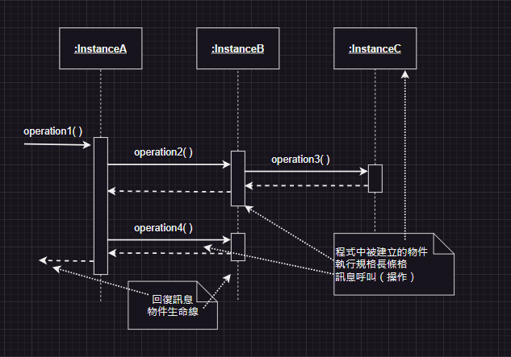

# 第2次隨堂-隨堂-QZ2
>
>學號：111111138
> 
>姓名：林奕廷
> 
>作業撰寫時間：60 (mins，包含程式撰寫時間)
> 
>最後撰寫文件日期：2024/05/06
>

本份文件包含以下主題：(至少需下面兩項，若是有多者可以自行新增)
- [x] 說明內容
- [x] 個人認為完成作業須具備觀念

## 說明程式與內容

## 個人認為完成作業須具備觀念
系統設計工作的種類。
包括架構設計、程式功能設計、介面設計、資料庫設計和安全性設計。
設計的基本概念就是將系統分割為一個最小且獨立的單位，最後再加以
整合，每一個小單位恰可解決一個完整的問題，同時要考量內聚力與耦
合力的問題。
循序圖表達了物件間如何互動，這些互動以操作的型態表現出來
循序圖的表現方式。
包括訊息呼叫與回覆、建立物件、圖形框架、巢狀框架等。
互動圖的另一項工具稱作溝通圖，溝通圖所要表達的內容和循序圖完全
相同，只是描繪的方式不同。